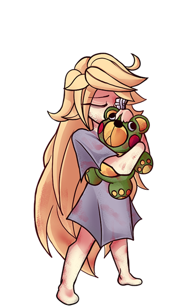

# Tiny Little Whispers
Tiny Little Whispers é um jogo de RPG 2D de terror e suspense psicológico, inspirado em atmósferas claustrofóbicas e narrativas sombrías como Little Nightmares, Mouthwashing e Sally Face. A história segue quatro crianças presas em um hospital psiquiátrico infantil, unindo-se para escapar enquanto enfrentam alucinações aterrorizantes e segredos perturbadores.

## Visão Geral
**Gênero**: RPG de Turnos / Terror Psicológico / Suspense;

**Engine**: Godot (GDScript);

**Status**: Protótipo;

**Plataforma Alvo**: PC.

## Mecânicas Principais
**Sistema de Turnos**: Combate estratégico com ações baseadas em recursos.

**Party Dinâmica**: Controle 4 personagens com arquétipos únicos.

**Itens Utilizáveis**: Colete e use objetos para sobreviver às batalhas.

**Inimigos com Traits**: Criaturas/alucinações com habilidades específicas e padrões de comportamento.

### Pirata: ### 

Tipo de ataque:
Principal fraqueza:

**Wiki**: 

### Homem do saco: ### 

Tipo de ataque:
Principal fraqueza:

**Wiki**: Silencioso. Só anda pelas ruas com passos lentos e o saco às costas, arrastando como se fosse pesado demais. Dizem que ele pega as crianças que desobedecem. Ninguém viu o rosto dele — só o vulto passando na calçada, no fim da rua, ou parado no canto escuro do quarto. Às vezes parece que ele está mais perto do que antes. E mesmo que ninguém acredite de verdade, quando a luz apaga, o medo sussurra que ele pode estar vindo agora.

### Palhaço: ### 

Tipo de ataque:
Principal fraqueza:

**Wiki**: O que deveria ser engraçado, vira estranho. O rosto pintado nunca muda, está sempre sorrindo, mesmo quando ele para de se mexer. O riso é alto demais, os olhos são grandes demais, os gestos são rápidos demais. Tudo nele parece exagerado, como se estivesse fingindo o tempo todo. E quando ele se aproxima, o coração bate mais forte — não de alegria, mas de medo. 

**Sistema de Sanidade**: Alucinações e eventos aleatórios afetam a party.

## Personagens
Cada criança possui um passado traumático e habilidades distintas:

### Luis -
Luís é um personagem com um espírito protetor. Muito embora a primeira vista pareça não tão apresentável (ou até aterrorizante), o garoto tem um grande coração e se importa muito com seus amigos!

**Classe**: Se localiza na posição traseira da ordem de ataque, sendo classificado como ranger. Responsavel pelo dano à distância.

### Levi -
Levi é um menino impaciente. De todos no grupo, é certamente o que mais quer sair dali. Ele tem sim uma consideração pelos amigos, mas não o leve a mal, seria legal que todos escapassem juntos, mas a prioridade era que a irmã saísse sã e salva. Ele pode nao conseguir demonstrar, mas a irmã é a coisa mais importante pra ele, até mais que ele mesmo. A única coisa que sobrou dele.

**Classe**: se localiza na posição atrás de Pedro da ordem de ataque, sendo classificado como fighter. Responsavel pelo maior dano da equipe, necessitando de menos estratégia. 

### Sofia -
Sofia é a luz do grupo. Desde o início se percebe que ela é quem levanta o astral de todos. Tenta animar todo mundo sempre que pode, usando vários métodos. Dentre estes, empresta Senhor Heraldo, seu ursinho, para que seus amigos deêm um abraço bem apertado!

**Classe**: se localiza na posição à frente de Luiz na ordem de ataque, sendo classificada como healer. Responsavel pela revigoração de sanidade da equipe.

### Pedro -
Pedro é a muralha do time. Pedro nunca foi de falar muito, mesmo que tenha pequenos diálogos com todos. Ele foi o primeiro a chegar na sala e era muito agressivo quando se tentava realizar alguma interação. Quando chegaram novas amizades em sua sala, ficou mais tranquilo.

**Classe**: se localiza na posição à frente de todos na ordem de ataque, sendo classificado como tank. Responsavel por receber maior parte do dano.

## Ambientação
O jogo se passa no Hospital Casa Santa Amélia, um local decadente onde os limites entre realidade e delírio se confundem.

## Tecnologia
**Engine**: Godot 4.x

**Linguagem**: GDScript

**Ferramentas**: _Descrever_

## Objetivos Atuais (Protótipo)
1. Implementar sistemas básicos (turnos, party, inventário).
2. Criar um MVP com 1 área jogável e 1 inimigo.

## Objetivos Gerais
Planejamos evoluir o protótipo para um jogo completo, com:
- Narrativa ramificada.
- Mecânicas de furtividade e puzzles.
- Mais inimigos e eventos aleatórios.
- Lançamento em plataformas como Steam.
- Licença oficial.

# Como Contribuir
Interessados em ajudar (artistas, programadores, escritores) podem entrar em contato via e-mail: ana.menezes62@aluno.ifce.edu.br. Aceitamos feedback e ideias!
