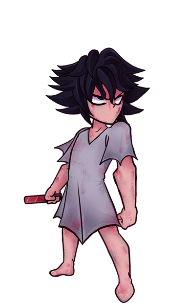
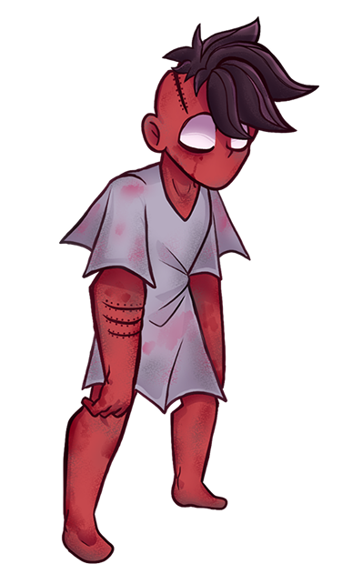

# Tiny Little Whispers
Tiny Little Whispers é um jogo de RPG 2D de terror e suspense psicológico, inspirado em atmósferas claustrofóbicas e narrativas sombrías como Little Nightmares, Mouthwashing e Sally Face. A história segue quatro crianças presas em um hospital psiquiátrico infantil, unindo-se para escapar enquanto enfrentam alucinações aterrorizantes e segredos perturbadores.

## Visão Geral
**Gênero**: RPG de Turnos / Terror Psicológico / Suspense;
**Engine**: Godot (GDScript);
**Status**: Protótipo;
**Plataforma Alvo**: PC.

## Mecânicas Principais
**Sistema de Turnos**: Combate estratégico com ações baseadas em recursos.
**Party Dinâmica**: Controle 4 personagens com arquétipos únicos.
**Itens Utilizáveis**: Colete e use objetos para sobreviver às batalhas.
**Inimigos com Traits**: Criaturas/alucinações com habilidades específicas e padrões de comportamento.
**Sistema de Sanidade**: Alucinações e eventos aleatórios afetam a party.

## Personagens
Cada criança possui um passado traumático e habilidades distintas:

### Luis - _Descrição a ser feita_

### Levi - _Descrição a ser feita_

### Sofia - _Descrição a ser feita_

### Pedro - _Descrição a ser feita_

## Ambientação
O jogo se passa no Hospital Casa Santa Amélia, um local decadente onde os limites entre realidade e delírio se confundem.

## Tecnologia
**Engine**: Godot 4.x
**Linguagem**: GDScript
**Ferramentas**: _Descrever_

## Objetivos Atuais (Protótipo)
1. Implementar sistemas básicos (turnos, party, inventário).
2. Criar um MVP com 1 área jogável e 1 inimigo.

## Objetivos Gerais
Planejamos evoluir o protótipo para um jogo completo, com:
- Narrativa ramificada.
- Mecânicas de furtividade e puzzles.
- Mais inimigos e eventos aleatórios.
- Lançamento em plataformas como Steam.
- Licença oficial.

# Como Contribuir
Interessados em ajudar (artistas, programadores, escritores) podem entrar em contato via e-mail: ana.menezes62@aluno.ifce.edu.br. Aceitamos feedback e ideias!
